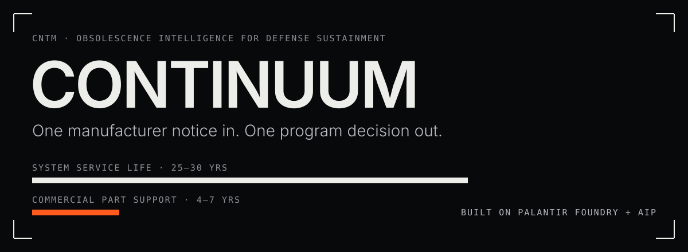
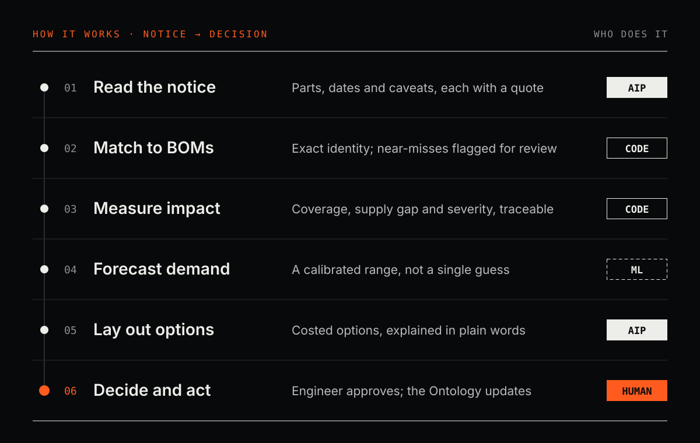
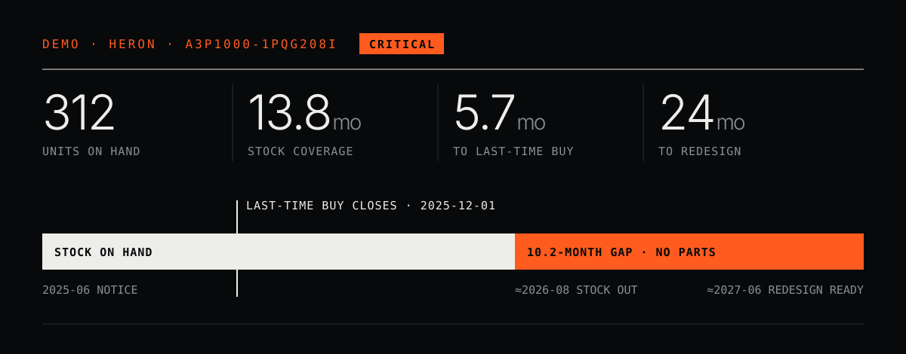
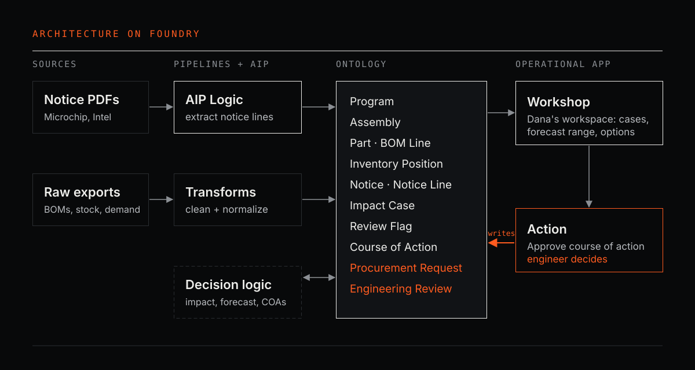

[](https://github.com/parisproffitt/DefenseObsolescenceIntelligence/actions/workflows/tests.yml) &nbsp;Palantir Foundry + AIP · Python · MIT

**CONTINUUM** helps defense sustainment engineers act on parts obsolescence. It reads a manufacturer's end-of-life notice, finds every program that depends on the discontinued parts, forecasts how many will be needed with an honest uncertainty range, and lays out costed options for the engineer to approve.

**In the demo**, one real Microchip notice reveals a program with a **10.2-month supply gap** that can't be fixed later. The recommended bridge buy cuts its shortage risk from **93% to 14%**.

---

## Why I built this

I've been fascinated by military aircraft for as long as I can remember, and I've always wanted to ride in one. Working in the defense industry changed how I see them. I realized that keeping one aircraft flying takes far more pieces and parts than I'd ever imagined: thousands of components, each with its own supplier, stock and lifespan. Behind every one of those parts are people tracking notices, checking bills of materials and planning purchases years ahead, mostly by hand.

That's the problem I chose: not the aircraft itself, but the unglamorous system that keeps it in the air. **A few-dollar part can ground a multimillion-dollar aircraft**, and it usually starts with a PDF nobody connected to the right program in time.

## The problem

Defense systems serve for 25–30 years. The commercial electronics inside them are supported for only 4–7. When a manufacturer discontinues a part, it publishes a notice with a last-time-buy date. An engineer then has to work out which programs use the part, how long the remaining stock will last, and whether to buy more or fund a redesign, before the window closes.

The DoD calls this **DMSMS** (Diminishing Manufacturing Sources and Material Shortages). The process is well defined. The bottleneck is information: notices, bills of materials, inventory and demand history all live in different places.

## How it works



The design rule behind every step: **code for identity and arithmetic, ML for uncertainty, AIP for language, and the engineer for judgment.** Every number shown to the engineer is computed in code and can be traced back to its source.

## AI and ML design

### AIP reads the notices
Notices come in every format: prose, tables, multi-page attachments, revisions. AIP Logic turns each one into structured rows (part number, deadlines, replacement), and **every row quotes the text it came from**. It also copies word for word any sentence that could change a buy decision. In the demo notice, Microchip says it *may cancel* the end-of-life if a new factory qualifies, and that caveat has to reach the engineer.

- **Guardrails:** the prompt forbids inventing parts, dates or replacements, and forbids calling a part compatible ([spec](docs/AIP_LOGIC.md)).
- **Measured, not trusted:** the output is scored against the manufacturers' real parts lists (230 part numbers).
  - **Recall** catches the costly error, a missed part.
  - **Precision** catches the dangerous one, an invented part.
  - Small and frontier models are compared on the same notices, and the cheaper one is kept wherever it scores the same ([D-14](DECISIONS.md)).

### ML forecasts demand as a range, not a guess
Spare-parts demand is lumpy: months of nothing, then a spike. A single-number forecast hides exactly the risk a buy decision is about. So CONTINUUM forecasts total demand over the decision window as a **distribution** and sizes purchases at a stated confidence level.

The first version was overconfident. Its "80% range" held only 69% of real outcomes on held-out data. A calibration step fitted on earlier data fixed it:

| Held-out test | Outcomes inside the P10–P90 range (target 80%) |
|---|---|
| Raw forecast, 200 series | 69% |
| **Calibrated forecast, 200 series** | **82%** |
| Calibrated forecast, demo programs | 85% |

The honest finding: the forecast's middle value is no sharper than a simple average. **Its value is a range you can trust** ([D-07](DECISIONS.md)). The demand data is synthetic, so this validates the method, not real-world accuracy.

### Decisions are costed under uncertainty
Each option is priced from the forecast distribution: purchase, storage, engineering cost, chance of running out, and expected excess stock. A stress test asks what happens if an aging fleet uses parts faster. That growth rate is a stated assumption the engineer can change, because a trend fitted to six years of lumpy data proved too noisy to trust ([D-10](DECISIONS.md)).

### Where AI is deliberately not used
Deciding whether a program's part appears on a notice is an identity question with one right answer. The demo notice mentions "A3P1000 device families" but only discontinues one package. A program using the same chip in a different package is **not** affected. Fuzzy or AI matching gets this wrong; exact matching is free, correct and auditable ([D-04](DECISIONS.md)).

## Demo: the Heron program



Replaying Microchip's real notice **CAAN-02OLLE763** as of June 2025, CONTINUUM gives the engineer three options for Heron:

| Option | Buy | Total cost | Shortage risk | If demand grows 5%/yr |
|---|---|---|---|---|
| Life-of-type buy | 5,640 | $1.53M | 10% | 99% |
| Redesign only | 0 | $1.45M | 93% | 94% |
| **Bridge buy + redesign** | **500** | **$1.55M** | **14%** | **18%** |

The life-of-type buy bets 17 years on one forecast. The bridge buy costs about the same and only has to be right for 24 months. The engineer makes the call, and CONTINUUM records it. *(Heron and its costs are fictional.)*

## Architecture on Foundry



Program data arrives the way a real customer would hand it over, as messy spreadsheet exports, and is cleaned inside Foundry. A Python reference implementation in this repo defines the correct results, and the Foundry pipelines are checked against it ([D-12](DECISIONS.md)). Build steps: [`docs/FOUNDRY_BUILD.md`](docs/FOUNDRY_BUILD.md).

## Data

- **Real:** the manufacturer notices and their 230 affected part numbers, deadlines and replacements (Microchip CAAN-02OLLE763, Intel PDN2401).
- **Notional:** the three programs (Heron, Kite, Petrel), their bills of materials, stock, costs and six years of demand. Real program data isn't public, so this is labeled everywhere.
- **Not included:** any employer data, and the notice PDFs themselves (linked, not redistributed).

## Engineering quality

- **27 automated tests** run on every push, including tests that pin every number in the demo.
- **Decision log:** [`DECISIONS.md`](DECISIONS.md) records each choice, the alternative considered, and why it lost, including first attempts that failed a check and what replaced them.

## From demo to deployment

A pilot with one program office would:
1. **Connect** live notice feeds (manufacturer portals and GIDEP, the government-industry exchange).
2. **Replace** the notional data with the program's own records and re-run every evaluation.
3. **Measure** hours from notice to decision, and shortages caught before the buy window closed.

<details>
<summary><b>Repository layout and quickstart</b></summary>

```
src/continuum/        reference implementation
  partnumbers.py      part-number normalization and notice matching
  generate.py         notional programs, bills of materials, stock, demand
  raw.py              messy raw exports for Foundry ingestion
  impact.py           coverage, supply gap, severity, review flags
  forecast.py         calibrated demand forecast and backtest
  coa.py              costed courses of action and stress test
  eval_extraction.py  scores AIP's notice extraction
data/                 notice registry and real parts lists (ground truth)
docs/                 Foundry build guide, AIP Logic spec, graphics
tests/                27 automated tests
```

```bash
pip install -e ".[dev]"
python scripts/build_all.py   # regenerates all data and prints the scenario
pytest
```
</details>

<details>
<summary><b>Ontology reference</b></summary>

| Object type | Primary key | Links |
|---|---|---|
| Program | `program_id` | Assembly, Impact Case |
| Assembly | `assembly_id` | Program |
| Part | `part_number` | — |
| BOM Line | `bom_line_id` | Assembly, Part |
| Inventory Position | `inventory_id` | Program, Part |
| Notice | `notice_id` | Notice Line |
| Notice Line | `notice_line_id` | Notice |
| Impact Case | `case_id` | Program, Part, Notice |
| Review Flag | `flag_id` | Program, Part, Notice |
| Course of Action | `coa_key` | Impact Case |
</details>

<sub>Licensed under the [MIT License](LICENSE).</sub>
