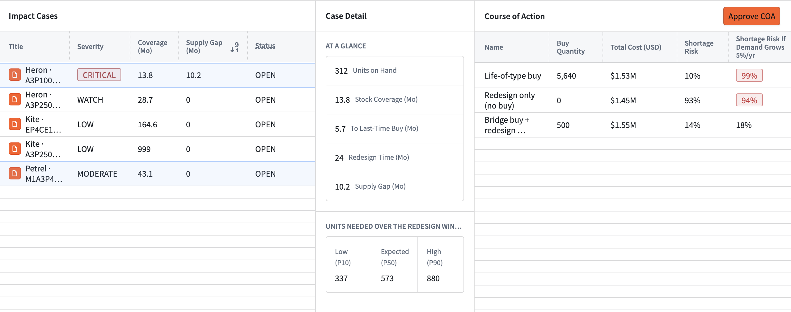
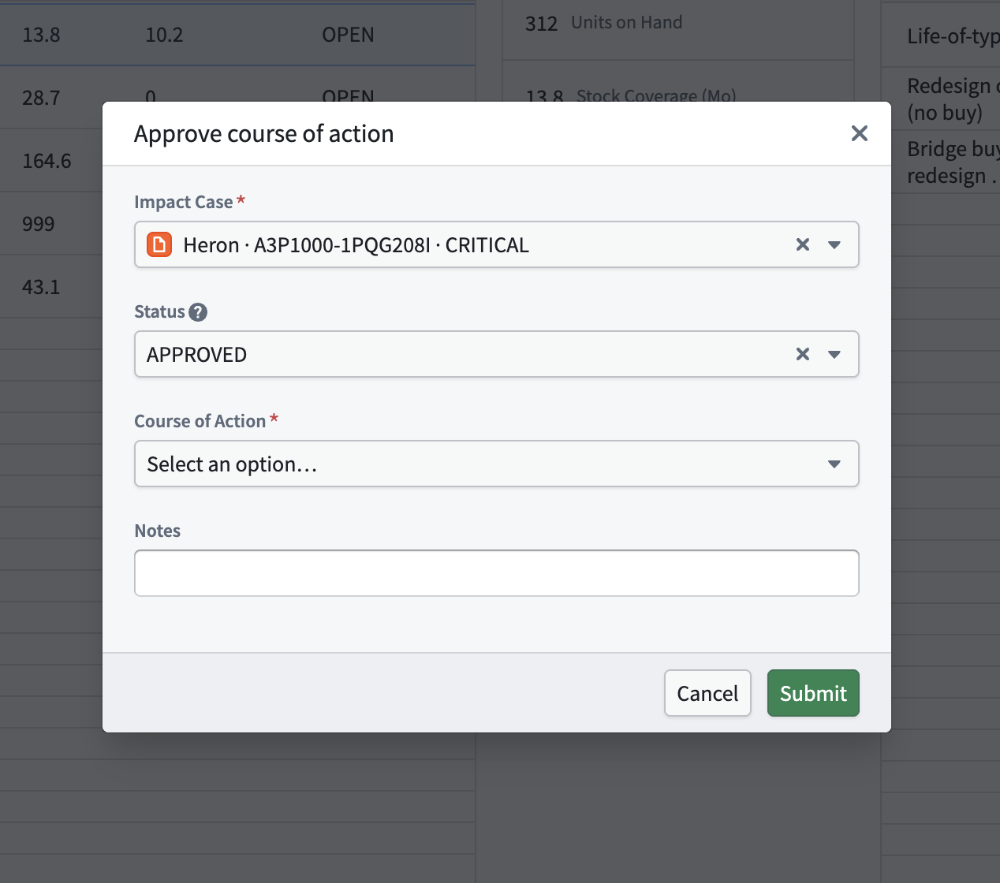

# CONTINUUM

**Decision support for defense parts obsolescence, built on Palantir Foundry and AIP.**

[](https://github.com/parisproffitt/DefenseObsolescenceIntelligence/actions/workflows/tests.yml) &nbsp;Palantir Foundry · AIP · Python · MIT

CONTINUUM turns a manufacturer's end-of-life notice into a program decision. It reads the notice, identifies every program that depends on the discontinued parts, forecasts future demand with a calibrated uncertainty range, and presents costed courses of action for an engineer to approve. The approval is recorded in the Foundry Ontology.

| | |
|---|---|
| **Problem** | Defense systems remain in service for 25–30 years; the commercial electronics inside them are supported for 4–7. Each discontinued part is a supply risk that arrives as a PDF. |
| **User** | A DMSMS (obsolescence) engineer responsible for several programs. |
| **Decision supported** | How many parts to buy before the last-time-buy window closes, and whether to start a redesign. |
| **Approach** | Deterministic code for matching and arithmetic, a calibrated forecast for uncertainty, AIP for reading documents, and a human approval for the decision. |
| **Demo result** | From one real Microchip notice: a program facing a 10.2-month supply gap, and a bridge-buy option that reduces shortage risk from 93% to 14%. |
| **Status** | Built in Foundry: data pipelines and decision logic (numbers equal the tested reference), the Ontology (12 object types, 15 links, merged after review), the *Approve course of action* Action with a self-filling form, and Steve's published Workshop app. The extraction model comparison runs in Pipeline Builder. The intake gate and memo number check are built and tested in code; wiring the schedule, notification and memo panel is the next step ([manual steps](docs/MANUAL_STEPS.md)). |

---

## Demonstration

**Video:** *link added on submission (October 5, 2026).* **Design review deck:** 34 slides covering the problem, data, architecture, AIP use, the app, the decision and how it was built.

**Steve's Workshop app** — impact cases ranked by supply gap (left), the selected case's coverage, gap and calibrated demand range (middle), and the three costed courses of action with stress-test risk (right):



**One-click approval** — the *Approve course of action* Ontology Action opens pre-filled from the selected case and option; the purchase request and engineering review it creates are filled from those objects, not typed:



| Screen | Shows |
|---|---|
| Decision memo *(screenshot to be added)* | The memo AIP drafts from the Ontology, beside *Approve* |
| AIP evaluation *(screenshot to be added)* | Extraction accuracy against the manufacturers' parts lists |
| Data lineage *(screenshot to be added)* | Raw exports → clean tables → analysis in Foundry |

<!-- Screenshots: docs/screenshots/{workshop-cases,workshop-heron,workshop-memo,action-approve,aip-logic-eval,lineage}.png -->

---

## Contents
1. [Motivation](#1-motivation)
2. [Users and the current workflow](#2-users-and-the-current-workflow)
3. [Domain background](#3-domain-background)
4. [Approach](#4-approach)
5. [Data and Ontology](#5-data-and-ontology)
6. [Demand forecasting (ML)](#6-demand-forecasting-ml)
7. [Notice extraction (AIP)](#7-notice-extraction-aip)
8. [Where AI is not used](#8-where-ai-is-not-used)
9. [Decision and action](#9-decision-and-action)
10. [Robustness](#10-robustness)
11. [Changes made during development](#11-changes-made-during-development)
12. [Limitations and next steps](#12-limitations-and-next-steps)

---

## 1. Motivation

I have been fascinated by military aircraft for as long as I can remember, and I have always wanted to ride in one. Working in the defense industry changed how I see them: keeping a single aircraft flying depends on thousands of parts, each with its own supplier, stock and lifespan, and on people who track notices, check bills of materials and plan purchases years in advance, largely by hand.

This project addresses that supporting system rather than the aircraft itself. A few-dollar part can ground a multimillion-dollar aircraft, and the failure usually begins with a notice that was not connected to the right program in time.

## 2. Users and the current workflow

The user is a **DMSMS engineer** supporting several fielded programs. When a notice arrives, the engineer must answer one question before the buy window closes: *what does this mean for my programs, and what should we do?*

Today that answer is assembled by hand from four separate sources: the notice, each program's bill of materials, inventory records, and demand history. One notice can list more than a hundred part numbers, and the demo notice leaves 5.7 months to place an order. The process is well defined by DoD guidance; the difficulty is connecting the information quickly and accurately.

## 3. Domain background

| Term | Meaning |
|---|---|
| **DMSMS** | Diminishing Manufacturing Sources and Material Shortages: the loss of a part's manufacturer or supply. |
| **End-of-life notice** | A manufacturer's announcement that parts will be discontinued, with ordering deadlines. |
| **LTB / LTS** | Last-time buy (final order date) and last-time ship (final delivery date). |
| **NCNR** | Non-cancellable, non-returnable: last-time-buy orders usually cannot be undone. |
| **Life-of-type buy** | Purchasing enough stock to support a system for the rest of its service life. |
| **Form, fit, function** | Whether a replacement is interchangeable. It requires engineering judgment. |
| **Tin whiskers** | A failure mode of pure-tin finishes, which is why a lead-free "replacement" still needs review. |

The demo uses Microchip notice **CAAN-02OLLE763** (ProASIC3 FPGAs, June 2025). It lists 110 part numbers in the 208-pin package only, sets a last-time buy of December 1, 2025, and states that the notice may be cancelled if an alternate assembly site qualifies.

## 4. Approach

| Step | Performed by | Reason |
|---|---|---|
| Read the notice | **AIP** | Unstructured documents in varied formats |
| Match parts to bills of materials | Code | An identity question with one correct answer |
| Measure coverage, gap and severity | Code | Every number must be traceable to its inputs |
| Forecast demand | **ML** | Demand is intermittent; the decision requires a range |
| Present options | **AIP**, from computed values | Explanation and drafting |
| Decide | **Engineer** | A consequential, partly irreversible decision |

The governing principle: **code for identity and arithmetic, ML for uncertainty, AIP for language, and the engineer for judgment.**

## 5. Data and Ontology

**Sources.** Every input is either real and public or notional and labeled; the full register, with links and how each item was checked, is [docs/DATA_SOURCES.md](docs/DATA_SOURCES.md).

| Real and public | Notional (fictional) |
|---|---|
| Microchip notice [CAAN-02OLLE763](https://mm.digikey.com/Volume0/opasdata/d220001/medias/docus/7131/CAAN-02OLLE763.pdf) (2025-06-06) and Intel [PDN2401](https://mm.digikey.com/Volume0/opasdata/d220001/medias/docus/5787/PDN2401_Rev1.0.0.pdf) (2024-01-15) | Programs Heron, Kite and Petrel, and the engineer Steve |
| Their 230 affected part numbers, dates and replacements, verified against the notice text both ways ([D-20](DECISIONS.md)) | Assemblies, bills of materials (non-notice parts carry an `NTL-` prefix), stock, unit costs, redesign cost and time |
| DoD [SD-22 DMSMS Guidebook](https://www.dau.edu/tools/t/SD-22-Diminishing-Manufacturing-Sources-and-Material-Shortages-(DMSMS)-Guidebook) (process); [DSP Journal, 2014](https://www.dsp.dla.mil/Portals/26/Documents/Publications/Journal/140901-DSPJ.pdf) (25–30-year service life vs 4–7-year support) | Six years of monthly demand (simulated, fixed seed); holding and growth assumptions |

Program sustainment data is not public, which is why the second column is notional. No employer data is used.

**Ingestion.** Program data arrives as it would from a customer: spreadsheet exports with inconsistent headers, padded and lower-case part numbers, a distributor suffix, and dates stored as text. Python transforms in Foundry clean it using the same normalization function as the matching step, and each table enforces its primary key as a build check ([D-16](DECISIONS.md)).

```python
# foundry/continuum-transforms/src/myproject/datasets/clean.py
@transform.using(
    out=Output(f"{CLEAN}/bom_lines", checks=_pk("bom_line_id")),   # duplicate key fails the build
    raw=Input(f"{RAW}/raw_bom_export"),
)
def bom_lines(out, raw):
    ...  # part numbers pass through partnumbers.normalize(), shared with matching
```

**Ontology.** The model mirrors how the engineer reasons: a notice line identifies a part; the part appears on bill-of-materials lines within assemblies; assemblies belong to programs. An impact case joins one notice to one program's part, and holds its courses of action. Keys are stable, readable strings (for example `CAAN-02OLLE763|A3P1000-1PQG208I`), so links survive data regeneration and can be audited by eye. Monthly demand remains a dataset because no workflow acts on a single month ([D-11](DECISIONS.md)). Ontology changes are made on a branch and merged after review ([D-17](DECISIONS.md)).

<!-- SCREENSHOT: Ontology graph around Heron (docs/screenshots/ontology.png) -->

## 6. Demand forecasting (ML)

**Why ML.** The buy decision depends on how many parts will be consumed over the redesign period. Spare-parts demand is intermittent (many zero months, then spikes), so a single-number forecast conceals the risk the decision is about. CONTINUUM forecasts cumulative demand as a distribution and sizes purchases at a stated confidence level.

**Validation.** The initial model was overconfident: its 80% range contained only 69% of held-out outcomes. A spread factor was fitted on earlier months and evaluated on later months the model had not seen ([D-07](DECISIONS.md)):

```python
# src/continuum/forecast.py
def calibrate_spread(demand, horizon=12, origins=range(36, 49, 3), target=0.80, grid=...):
    """Smallest spread whose P10-P90 coverage reaches `target` on the calibration origins."""
```

| Held-out evaluation | Outcomes within the P10–P90 range (target 80%) |
|---|---|
| Uncalibrated, 200 series | 69% |
| **Calibrated, 200 series** | **82%** |
| Calibrated, demo programs | 85% |

The median forecast is no more accurate than a simple average; the value of the model is a range that can be trusted. The demand data is synthetic, so these results validate the method rather than real-world accuracy.

## 7. Notice extraction (AIP)

**Why AIP.** Notices arrive as prose, tables and multi-page attachments in manufacturer-specific formats. Reading them is a language task. AIP extracts one row per affected part and must quote the source text for every row. It also copies verbatim any sentence that could change a purchasing decision, such as the demo notice's possible cancellation.

```text
1. List EVERY affected ordering part number in the text, exactly as printed.
2. Never invent a part number, date, or replacement. If a field is not stated, return null.
4. A replacement counts only if the notice explicitly pairs it with that part.
   Do not suggest one, and never state that a part is compatible.
5. For every row, quote the shortest verbatim text that supports it.
```

**Where AIP sits in the workflow.** AIP is used at three points, each with a rule that can be checked ([D-21](DECISIONS.md)):

| Step | AIP capability | Output | Rule |
|---|---|---|---|
| Read the notice | AIP Logic `extractNoticeLines` | Notice Line objects, one per part, each with a verbatim quote | Never normalizes or invents a part number |
| Choose the model | Language models in a Foundry transform | Field-by-field scores for a small and a frontier model | Keep the cheaper model where scores hold |
| Explain the options | AIP Logic `draftDecisionMemo`, reading Impact Case and Course of Action objects | The memo shown in Workshop beside *Approve* | Every number must appear in the Ontology input (`memo.unsupported_numbers`); no recommendation |

```python
def unsupported_numbers(memo: str, input_block: str) -> list[str]:
    """Numbers in the memo that do not appear in the input. Empty list = memo may be shown."""
    return sorted(_numbers(memo) - _numbers(input_block))
```

**Evaluation.** Output is scored against the manufacturers' parts lists (230 part numbers) for recall (missed parts), precision (invented parts), date accuracy and replacement accuracy. Two models are compared, and the less expensive model is retained where accuracy is equal ([D-14](DECISIONS.md), [D-19](DECISIONS.md)). *Results will be reported here once the model run completes.*

<!-- SCREENSHOT: AIP Logic function and evaluation results (docs/screenshots/aip-logic-eval.png) -->

**Autonomous intake.** A new notice runs end to end with no one clicking anything: a build schedule fires on arrival, AIP extracts the rows, a code gate checks every row against the notice text (and holds the notice if any part number was missed), the analysis rebuilds, and Foundry Automate notifies the engineer. The approval stays human ([D-23](DECISIONS.md), [docs/AUTOMATION.md](docs/AUTOMATION.md)).

## 8. Where AI is not used

Two decisions are deliberately kept away from AI:

- **Part matching.** Whether a program's part appears on a notice has one correct answer. The demo notice refers to "A3P1000 device families" but discontinues only the 208-pin package; a program using the same device in a 484-ball package is not affected. Fuzzy or model-based matching would report a false alarm. Matching is therefore exact, with near-misses flagged for review ([D-04](DECISIONS.md)).
- **Compatibility and computation.** AIP never declares a replacement compatible, and never produces numbers. Coverage, gaps, costs and risks are computed in code; AIP explains them ([D-05](DECISIONS.md), [D-09](DECISIONS.md)).

```python
# src/continuum/partnumbers.py
n = normalize(bp)                         # trim, upper-case, drop distributor suffixes
if n in exact:
    results.append(MatchResult(bp, MatchType.EXACT, exact[n]))
    continue
device = parse(bp).device                 # same device, different package or grade?
if device and device in by_device:
    results.append(MatchResult(bp, MatchType.FAMILY_ONLY, by_device[device]))
else:
    results.append(MatchResult(bp, MatchType.NONE, None))
```

## 9. Decision and action

The demo replays the Microchip notice as of June 10, 2025, against three fictional programs.

| Heron · A3P1000-1PQG208I | |
|---|---|
| Units on hand | 312 |
| Stock coverage | 13.8 months |
| Last-time buy closes in | 5.7 months |
| Redesign lead time | 24 months |
| **Assessment** | **Critical: 10.2 months without parts** |

| Course of action | Units | Total cost | Shortage risk | With 5%/yr demand growth |
|---|---|---|---|---|
| Life-of-type buy | 5,640 | $1.53M | 10% | 99% |
| Redesign only | 0 | $1.45M | 93% | 94% |
| **Bridge buy + redesign** | **500** | **$1.55M** | **14%** | **18%** |

The life-of-type buy depends on a 17-year forecast; the bridge buy costs approximately the same and depends on a 24-month forecast. *(Costs are notional.)*

**The operator acts in one step.** The Action *Approve course of action* records the decision and, in the same transaction, creates a procurement request (quantity and cost copied from the selected option) and an engineering review. A case cannot be marked approved without the follow-up work that makes the decision real ([D-18](DECISIONS.md)).

<!-- SCREENSHOT: Approve course of action, before and after (docs/screenshots/action-approve.png) -->

## 10. Robustness

| Condition | System response |
|---|---|
| Demand grows as the fleet ages | Every option is re-priced under a stated growth rate the engineer can adjust ([D-10](DECISIONS.md)) |
| The manufacturer may cancel the notice | The caveat is extracted verbatim and presented with the decision |
| A new notice arrives | The same pipeline runs again and produces new impact cases |
| A replacement changes its finish | Flagged for tin-whisker review; never approved automatically ([D-05](DECISIONS.md)) |
| An export contains a bad row | Primary-key checks fail the build before data reaches the Ontology ([D-16](DECISIONS.md)) |
| The model misreads a notice | Failed calls are recorded and scored, not dropped ([D-19](DECISIONS.md)) |

## 11. Changes made during development

| Area | Initial approach | Finding | Change |
|---|---|---|---|
| Forecast range | Uncalibrated bootstrap | 69% coverage against an 80% target | Calibrated and tested on unseen months (82%) |
| Evaluation size | 11 series | 80% in-sample, 67% held out | 200-series evaluation corpus |
| Growth risk | Trend fitted to demand | Estimated +17%/yr against a true 6% | Stated, adjustable 5% scenario |
| Life-of-type buy | Purchase cost only | Appeared cheapest and safest | Holding cost and stress test added |
| Data cleaning | Pipeline Builder | Would duplicate the matching logic | Transforms share one `normalize()` |
| Scope of AI | AI-assisted matching | False alarm on a different package | Exact matching with review flags |

Each change is documented with its evidence in [`DECISIONS.md`](DECISIONS.md).

## 12. Limitations and next steps

**Limitations.** Program data and demand are notional; forecast results validate the method, not real-world accuracy. AIP extraction accuracy is not yet measured. Costs are illustrative.

**Path to deployment.** A pilot with one program office would connect live notice feeds (manufacturer portals and GIDEP), replace notional data with the program's records and repeat every evaluation, and measure the time from notice to decision and the shortages identified before the buy window closed.

---


## References

The workflow follows the DoD **SD-22 DMSMS Guidebook** (Defense Standardization Program Office, updated January 2026): *identify* (AIP reads the notice, code matches BOMs), *assess* (impact cases), *analyze* (demand range, costed options, memo) and *implement* (the engineer's approval, written back by an Action) ([D-24](DECISIONS.md)). Full citations, what each source is used for and what it does not support: [docs/RESEARCH.md](docs/RESEARCH.md).

- DoD SD-22 DMSMS Guidebook; DoD Engineering of Defense Systems Guidebook (2022, Change 2 2024); SAE STD0016A (2023).
- Sandborn, Prabhakar & Ahmad, *Microelectronics Reliability* 51(2), 2011; Mastrangelo, Olson & Summers, *Microelectronics Reliability* 127, 2021.
- DSP Journal, Jul/Sep 2014; Microchip CAAN-02OLLE763; Intel PDN2401; Analog Devices product life cycle policy.
- Palantir Foundry, Ontology, AIP, AIP Logic and Automate documentation.

<details>
<summary><b>Repository and reproduction</b></summary>

```
src/continuum/        reference implementation (Python)
  partnumbers.py      part-number normalization and notice matching
  generate.py         notional programs, bills of materials, stock, demand
  raw.py              raw exports for Foundry ingestion
  impact.py           coverage, supply gap, severity, review flags
  forecast.py         calibrated demand forecast and backtest
  coa.py              courses of action and stress test
  extraction.py       AIP extraction prompt, chunking and parsing
  eval_extraction.py  extraction scoring against ground truth
  verify_truth.py     answer key checked against the notices, both ways
foundry/              code deployed to Foundry (transforms, Ontology identifiers)
data/                 notice registry and manufacturer parts lists (ground truth)
docs/                 build guide, AIP specification, demo script, manual steps
tests/                35 automated tests
```

```bash
pip install -e ".[dev]"
python scripts/build_all.py   # regenerates all data and prints the scenario
pytest
```
</details>

<details>
<summary><b>Documentation</b></summary>

| Document | Contents |
|---|---|
| [`DECISIONS.md`](DECISIONS.md) | Every design decision, the alternative considered, and the reason |
| [`docs/FOUNDRY_BUILD.md`](docs/FOUNDRY_BUILD.md) | How the system is built in Foundry |
| [`docs/AIP_LOGIC.md`](docs/AIP_LOGIC.md) | Extraction prompt, output schema and evaluation |
| [`docs/DEMO_SCRIPT.md`](docs/DEMO_SCRIPT.md) | The five-minute demonstration |
| [`docs/MANUAL_STEPS.md`](docs/MANUAL_STEPS.md) | Steps completed in the Foundry interface |
</details>

<sub>Programs Heron, Kite and Petrel are fictional. Licensed under the [MIT License](LICENSE).</sub>
