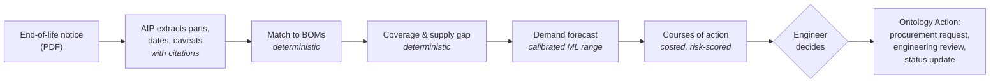
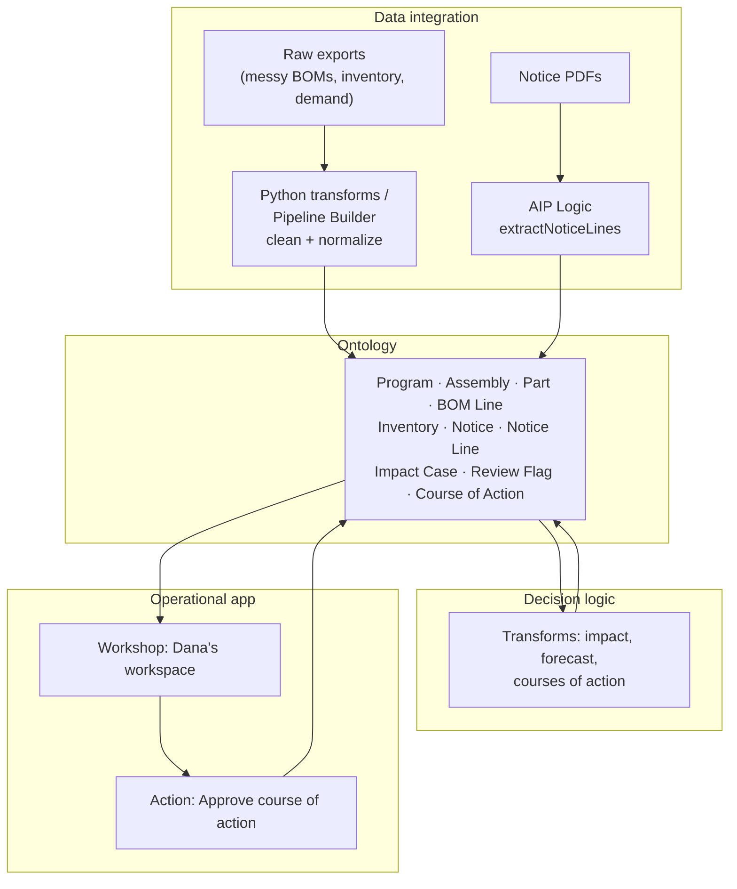

# CONTINUUM

**Obsolescence intelligence for defense sustainment. One manufacturer notice in, one program decision out.**

[](https://github.com/parisproffitt/DefenseObsolescenceIntelligence/actions/workflows/tests.yml)
&nbsp;Built on **Palantir Foundry + AIP** · Python · MIT

| | |
|---|---|
| **Problem** | Defense systems serve 25–30 years; the commercial electronics inside them are supported for 4–7. Every discontinued part is a supply risk hidden in a PDF. |
| **Operator** | A DMSMS engineer responsible for parts obsolescence across several programs. |
| **Decision** | Buy stock before the window closes, fund a redesign, or both, and how much. |
| **What CONTINUUM does** | Reads the notice, finds every affected program, forecasts demand with an honest uncertainty range, and lays out costed options for the engineer to approve. |
| **Demo result** | From one real Microchip notice: a program with a **10.2-month supply gap** that can't be fixed later, and a bridge-buy plan that cuts shortage risk from **93% to 14%**. |

---

## 1. The problem

When a manufacturer discontinues a part, it publishes an end-of-life notice, usually a PDF listing dozens or hundreds of part numbers and a last-time-buy date. Someone then has to work out, by hand, what that document means: which programs use those parts, how much stock is left, how long it will last, and whether there is still time to act.

The DoD calls this **DMSMS** (Diminishing Manufacturing Sources and Material Shortages) and has a whole process for it (the SD-22 guidebook, Health Status Reports, defined resolution options). The process is sound. The information is the bottleneck: notices, bills of materials, inventory and demand live in separate places. A few-dollar part can ground a multimillion-dollar aircraft years after a notice was missed.

## 2. The proposal

CONTINUUM closes the loop from document to decision:



Every stage writes to the Foundry Ontology, so the engineer can trace any recommendation back to the notice line, the bill of materials and the demand history behind it.

## 3. Design principles

1. **Each step uses the tool that fits it.** Code for identity and arithmetic, ML for uncertainty, AIP for language, the engineer for judgment.
2. **Every number is traceable.** Coverage, gaps, buy quantities and risks are computed in code. AIP explains them; it never estimates them.
3. **AI output is measured, not trusted.** Extraction is scored against real ground truth. The forecast's uncertainty range is calibrated on held-out data.
4. **Humans own consequential calls.** AIP flags replacement differences but never declares a part compatible. Nothing is bought or approved without the engineer.
5. **Limits are stated, not hidden.** What's real, what's notional, and what the evaluation does and doesn't prove are all written down.

## 4. AI / ML design

CONTINUUM uses three kinds of intelligence, each chosen for a specific sub-problem, plus one deliberate choice *not* to use AI.

### 4.1 Language: AIP extracts facts from manufacturer notices
Notices arrive in every format: prose, tables, multi-page attachments, revisions. AIP Logic reads each one and returns one row per affected part (part number, last-time-buy and last-ship dates, replacement), **each with a verbatim quote from the source**. It also copies any sentence that could change a buy decision, such as Microchip's note that it *may cancel* this end-of-life notice if a new assembly site qualifies.

**Guardrails** ([spec](docs/AIP_LOGIC.md)): the prompt forbids inventing parts, dates or replacements, and forbids declaring compatibility.

**Evaluation** ([D-14](DECISIONS.md)): `eval_extraction.py` scores the output against the manufacturers' real parts lists (230 part numbers).
- **Recall** measures the costly error: did it miss an affected part?
- **Precision** measures the dangerous one: did it invent a part?
- It also reports date accuracy, replacement accuracy and citation coverage.
- Small and frontier models are compared on the same notices, and the cheaper one is kept wherever it scores the same.

### 4.2 Prediction: a calibrated forecast of lumpy spare-parts demand
Spare-parts demand is intermittent: months of zero, then spikes. A single-number forecast hides exactly the risk a buy decision is about. So CONTINUUM forecasts **cumulative demand over the decision window as a distribution**, using a bootstrap over recent history, and sizes buys at a stated service level.

The first version was overconfident, so it was fixed and re-tested ([D-06, D-07](DECISIONS.md)):

| Held-out test (12-month demand) | Error vs. plain average | Outcomes inside P10–P90 (target 80%) |
|---|---|---|
| Raw bootstrap, 200 series | 1.05× | 69% |
| **Calibrated (spread × 1.35), 200 series** | 1.05× | **82%** |
| Calibrated, program series | 0.95× | 85% |

Calibration was fitted on early origins (months 36–48) and reported on later ones (51–60). An 11-series test looked calibrated in-sample (80%) but fell to 67% out of sample, which is why the evaluation uses 200 series. The honest finding: **the median is no sharper than an average; the value is a range you can trust.** The data is synthetic, so this validates the method, not real-world accuracy.

### 4.3 Decisions under uncertainty: costed courses of action
Each option is priced from the demand distribution: procurement, holding cost, engineering, probability of shortage, and expected excess stock. A **stress test** asks what happens if an aging fleet consumes parts faster (+5%/yr). It's a stated, adjustable assumption, because a trend fitted to six years of lumpy data was off by ±11 points in simulation ([D-08, D-10](DECISIONS.md)).

### 4.4 Where AI is deliberately *not* used
Matching a bill-of-materials line to a discontinued part is an identity question with one right answer. The ProASIC3 notice says "A3P1000 device families" but only discontinues the 208-pin package, so a program's A3P1000 in a 484-ball package is **not** affected. Fuzzy or LLM matching gets this wrong. Exact matching on normalized part numbers is free, correct and auditable ([D-04](DECISIONS.md)).

## 5. Demo scenario

Replaying Microchip's real notice **CAAN-02OLLE763** (ProASIC3 FPGAs, last-time buy 2025-12-01) as of **2025-06-10**, against three fictional programs:

| Program | Part | On hand | Coverage | Severity |
|---|---|---|---|---|
| **Heron** (airlift fleet) | A3P1000-1PQG208I | 312 | 13.8 mo | **CRITICAL.** Out of stock 10.2 months before a 24-month redesign could be ready; the buy window closes in 5.7 months |
| Heron | A3P250-PQG208I | 170 | 28.7 mo | WATCH |
| Petrel (radar) | M1A3P400-1PQG208I | 133 | 43.1 mo | MODERATE |
| Kite (trainer) | A3P250-PQG208I | 280 | beyond support life | LOW |

**Heron's options** (notional costs):

| Course of action | Buy | Total cost | Shortage risk | If demand grows 5%/yr |
|---|---|---|---|---|
| Life-of-type buy | 5,640 | $1.53M | 10% | 99% |
| Redesign only | 0 | $1.45M | 93% | 94% |
| **Bridge buy + redesign** | **500** | **$1.55M** | **14%** | **18%** |

The life-of-type buy bets 17 years of support on one forecast. The hybrid costs about the same and only has to be right for 24 months.

**Review flags:**
- Petrel's A3P1000 in the 484-ball package is flagged as a near match, not counted as affected.
- Intel's "pin-compatible" replacement in notice PDN2401 switches from tin-lead to lead-free finish, which is a tin-whisker review item.

## 6. Architecture on Foundry



The cleaning runs inside Foundry, from deliberately messy spreadsheet-style exports, and must reproduce the Python reference implementation exactly ([D-12](DECISIONS.md)). Step-by-step build: [`docs/FOUNDRY_BUILD.md`](docs/FOUNDRY_BUILD.md).

<details>
<summary><b>Ontology reference</b> (10 object types)</summary>

| Object type | Backing dataset | Primary key | Links |
|---|---|---|---|
| Program | `programs` | `program_id` | has many Assembly, Impact Case |
| Assembly | `assemblies` | `assembly_id` | belongs to Program |
| Part | `parts` | `part_number` | — |
| BOM Line | `bom_lines` | `bom_line_id` | Assembly, Part |
| Inventory Position | `inventory` | `inventory_id` | Program, Part |
| Notice | `notices` | `notice_id` | has many Notice Line |
| Notice Line | `notice_lines` | `notice_line_id` | Notice |
| Impact Case | `impact_cases` | `case_id` | Program, Part, Notice |
| Review Flag | `review_flags` | `flag_id` | Program, Part, Notice |
| Course of Action | `coas` | `coa_key` | Impact Case |

Keys are stable, human-readable strings, e.g. `CAAN-02OLLE763|A3P1000-1PQG208I` ([D-11](DECISIONS.md)). Monthly demand stays a dataset, since no workflow acts on a single month.
</details>

## 7. Data

| Data | Real or notional | Source |
|---|---|---|
| End-of-life notices, affected parts, dates, replacements | **Real** | Microchip CAAN-02OLLE763, Intel PDN2401 ([registry](data/notices)) |
| Programs, assemblies, bills of materials | Notional | Seeded with real discontinued part numbers |
| Inventory, costs, six years of monthly demand | Notional | Lumpy, trended, fixed seed |

Real sustainment data for defense programs isn't public, so the programs are notional, and labeled as such everywhere. The hardest input, messy manufacturer documents in real formats, stays real, so the extraction scores mean something. Notices are linked, not redistributed. No employer data is used.

## 8. Quality

- **27 automated tests** run on every push, including tests that pin every number in the demo story.
- **Reference implementation:** the Python code in `src/continuum/` defines correct behavior, and the Foundry pipelines are checked against it.
- **Decision log:** [`DECISIONS.md`](DECISIONS.md) records every design choice with the alternative considered and why it was rejected. Several entries record a first approach that failed a check and what replaced it.

## 9. From demo to deployment

A pilot with one program office would:
1. **Connect** live notice feeds (manufacturer portals, GIDEP) and monitor them continuously.
2. **Replace** notional data with the program's own bills of materials, stock and demand history, then re-run every evaluation.
3. **Measure** hours from notice to decision, and shortages caught before the buy window closed.

---

<details>
<summary><b>Repository layout and quickstart</b></summary>

```
src/continuum/
  partnumbers.py      normalization, part-number parsing, notice matching
  generate.py         notional programs, BOMs, inventory, demand; evaluation corpus
  raw.py              messy raw exports for Foundry ingestion
  impact.py           notice → impact cases, coverage, gap, severity, review flags
  forecast.py         baselines, bootstrap, calibration, rolling-origin backtest
  coa.py              courses of action, holding cost, growth stress test
  eval_extraction.py  scores AIP notice extraction against ground truth
scripts/build_all.py  generates everything into output/ (the Foundry upload set)
data/notices/         notice registry and sources
data/reference/       real affected-part lists (ground truth)
docs/                 Foundry build guide, AIP Logic spec
tests/                27 pytest cases
DECISIONS.md          design decision log
```

```bash
pip install -e ".[dev]"
python scripts/build_all.py   # writes output/*.csv and prints the scenario
pytest
```
</details>

*Programs Heron, Kite and Petrel are fictional. Licensed under the [MIT License](LICENSE).*
